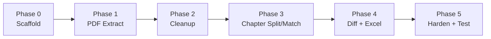

# PdfSpecDiffReporter – Build Workflow

> Read `codex/SKILL.md` first for constraints and data contracts.

---

## Phase 0 — Repository Scaffold & Dependencies

**Agent:** `codex/agents/01_project_setup/SKILL.md`

### Steps

1. Create solution & projects:
   ```bash
   dotnet new sln -n PdfSpecDiffReporter
   dotnet new console -n PdfSpecDiffReporter -f net8.0
   dotnet new xunit -n PdfSpecDiffReporter.Tests -f net8.0
   dotnet sln add PdfSpecDiffReporter/PdfSpecDiffReporter.csproj
   dotnet sln add PdfSpecDiffReporter.Tests/PdfSpecDiffReporter.Tests.csproj
   dotnet add PdfSpecDiffReporter.Tests reference PdfSpecDiffReporter
   ```

2. Add NuGet packages:
   ```bash
   cd PdfSpecDiffReporter
   dotnet add package UglyToad.PdfPig
   dotnet add package ClosedXML
   dotnet add package DiffPlex
   dotnet add package System.CommandLine --prerelease
   dotnet add package Spectre.Console
   cd ../PdfSpecDiffReporter.Tests
   dotnet add package Moq
   dotnet add package FluentAssertions
   ```

3. Configure `.csproj` for single-file publish:
   ```xml
   <PropertyGroup>
     <OutputType>Exe</OutputType>
     <TargetFramework>net8.0</TargetFramework>
     <RuntimeIdentifier>win-x64</RuntimeIdentifier>
     <PublishSingleFile>true</PublishSingleFile>
     <SelfContained>true</SelfContained>
     <IncludeNativeLibrariesForSelfExtract>true</IncludeNativeLibrariesForSelfExtract>
     <EnableCompressionInSingleFile>true</EnableCompressionInSingleFile>
   </PropertyGroup>
   ```

4. Create directory structure:
   ```
   PdfSpecDiffReporter/
   ├── Pipeline/
   ├── Models/
   └── Helpers/
   ```

5. Implement `Program.cs` with a Hello World CLI skeleton using `System.CommandLine`.

### Gate

```bash
dotnet build --configuration Release --warnaserror
dotnet publish -c Release -r win-x64 --self-contained true /p:PublishSingleFile=true
# EXE must run and print help text
```

---

## Phase 1 — PDF Page-Level Text Extraction

**Agent:** `codex/agents/02_pdf_extract/SKILL.md`

### Steps

1. Implement `SecureIngestion.cs`:
   - Accept file path → open `FileStream` (read-only, no share)
   - Copy entire stream into `MemoryStream`
   - **Close `FileStream` immediately** (within `using` block)
   - Return `MemoryStream` for downstream processing

2. Implement page-level text extraction using PdfPig:
   - Open document from `MemoryStream` via `PdfDocument.Open(stream)`
   - For each page: extract text with word coordinates (X, Y, font size)
   - Return `List<PageText>` where `PageText = { PageNumber, Lines[], Words[] }`
   - **Never store full document text in a single string**

3. Write unit tests:
   - Test that `FileStream` is closed after ingestion
   - Test page text output structure (use synthetic in-memory PDF if possible)
   - Test that `MemoryStream` is properly disposed after use

### Gate

```bash
dotnet build --warnaserror
dotnet test --no-build
```

---

## Phase 2 — Text Cleanup & Normalization

**Agent:** `codex/agents/03_text_cleanup/SKILL.md`

### Steps

1. Implement `TextCleanup.cs`:
   - **Header/Footer Detection:** Analyze top 10% and bottom 10% of each page by Y-coordinate
   - Find text blocks that repeat across ≥ 3 consecutive pages (fuzzy match ≥ 0.9)
   - Remove detected headers/footers from page content
   - Handle page numbers (numeric-only lines at top/bottom)

2. Implement `TextNormalizer.cs`:
   - Collapse multiple whitespace → single space
   - Normalize line endings → `\n`
   - Trim leading/trailing whitespace per line
   - Remove control characters except `\n` and `\t`
   - Normalize Unicode (NFC form)

3. Write unit tests:
   - Test header detection with synthetic repeated strings
   - Test footer removal preserves body text
   - Test normalization edge cases (mixed line endings, tabs, Unicode)
   - Test page number removal

### Gate

```bash
dotnet build --warnaserror
dotnet test --no-build
```

---

## Phase 3 — Chapter Segmentation & Matching

**Agent:** `codex/agents/04_chapter_split_match/SKILL.md`

### Steps

1. Implement `ChapterSegmenter.cs`:
   - **Strategy 1 (TOC Priority):** Parse first 5 pages for table-of-contents patterns
   - **Strategy 2 (Regex Fallback):** Scan full text with pattern:
     ```regex
     ^(\d+(\.\d+)*)\s+|^SECTION\s+\d+|^CHAPTER\s+\d+
     ```
   - Build `List<ChapterNode>` tree using stack-based parent identification:
     - Depth = number of dot-separated segments (e.g., "1.2.3" → depth 3)
     - Push/pop parent stack based on depth comparison
   - Populate `Content` (StringBuilder), `PageStart`, `PageEnd` for each chapter

2. Implement `ChapterMatcher.cs`:
   - Input: `sourceChapters: List<ChapterNode>`, `targetChapters: List<ChapterNode>`
   - **Exact match** on chapter key (e.g., "1.2" == "1.2")
   - **Fuzzy match** on title similarity (Levenshtein ratio ≥ 0.8) for renamed chapters
   - Output: `List<(ChapterNode? source, ChapterNode? target)>` — matched pairs + unmatched

3. Write unit tests:
   - Test segmentation from synthetic flat text with numbered headings
   - Test hierarchy construction (parent-child relationships)
   - Test exact matching, fuzzy matching, and unmatched detection
   - Test edge case: document with no detectable chapters → single root node

### Gate

```bash
dotnet build --warnaserror
dotnet test --no-build
```

---

## Phase 4 — Diff Engine & Excel Export

**Agents:**
- `codex/agents/05_diff_engine/SKILL.md`
- `codex/agents/06_excel_writer/SKILL.md`

### Steps (Diff Engine)

1. Implement `DiffEngine.cs`:
   - For each matched chapter pair, split content into paragraphs (double-newline delimiter)
   - Compute paragraph-level diff using DiffPlex (or custom LCS)
   - Classify changes:
     - **Added:** paragraph exists only in target
     - **Deleted:** paragraph exists only in source
     - **Modified:** similarity ≥ threshold (default 0.85) — show both versions
     - **Replaced:** similarity < threshold — treat as Delete + Add
   - Output: `List<DiffItem>` with truncated text (≤ 500 chars)

2. Implement `SimilarityCalculator.cs`:
   - Levenshtein distance normalized to [0.0, 1.0]
   - Optionally use DiffPlex's built-in differ for line-level analysis

### Steps (Excel Export)

3. Implement `ExcelReporter.cs` using ClosedXML:
   - **Sheet 1: Summary**
     - Source file, target file, total chapters, matched, modified, added, deleted, processing time
   - **Sheet 2: ChangeDetails**
     - Chapter ID, section title, change type, before (old), after (new), similarity %, page refs
     - Color-code: green=Added, red=Deleted, yellow=Modified
     - Wrap text, auto-fit columns
   - **Sheet 3: Unmatched**
     - Origin (Old/New), chapter ID, title, status
   - File path: `--output` flag or default `Diff_Report_{Timestamp}.xlsx`
   - Write directly from memory via `workbook.SaveAs(fileStream)`

4. Write unit tests:
   - Test diff classification with synthetic paragraph pairs
   - Test similarity score calculation
   - Test Excel output (open generated file, verify sheet count and header rows)
   - Test text truncation at 500 chars

### Gate

```bash
dotnet build --warnaserror
dotnet test --no-build
```

---

## Phase 5 — Hardening & Acceptance Tests

**Agent:** `codex/agents/07_cli_ux_tests/SKILL.md`

### Steps

1. **CLI UX Polish:**
   - Wire up `System.CommandLine` with all arguments and options
   - Add `Spectre.Console` progress bar showing pipeline phase progress
   - Implement phase status messages:
     - `[1/5] Loading PDFs...`
     - `[2/5] Cleaning text...`
     - `[3/5] Matching chapters...`
     - `[4/5] Computing differences...`
     - `[5/5] Generating report...`
   - Implement exit codes: 0 (success), 1 (error), 2 (invalid args)

2. **Error Handling:**
   - Wrap entire pipeline in `try/catch` with `ExceptionSanitizer`
   - Validate file paths before processing (file exists, is `.pdf`, readable)
   - Handle corrupt PDFs gracefully (PdfPig exceptions → user-friendly message)
   - Ensure no temp files are left on disk (verify in `finally` block)

3. **Performance:**
   - Profile with `Stopwatch` per phase
   - Target: two 500-page PDFs in < 60 seconds
   - Use `Parallel.ForEach` for page-level text extraction if bottleneck

4. **Acceptance Tests (documented, not necessarily automated):**

   | ID | Type | Scenario | Expected |
   |---|---|---|---|
   | AT-01 | Security | Network isolation | Zero outbound packets |
   | AT-02 | Security | Data residue | No `.tmp`/`.txt` files after run |
   | AT-03 | Performance | 500-page PDFs | < 60 seconds |
   | AT-04 | Functional | Chapter mapping | Detects modification in "2.1", insertion of new "3" |

5. **Final Publish:**
   ```bash
   dotnet publish -c Release -r win-x64 --self-contained true \
     /p:PublishSingleFile=true /p:EnableCompressionInSingleFile=true
   ```

### Gate

```bash
dotnet build --configuration Release --warnaserror
dotnet test --configuration Release --no-build --verbosity normal
# Manual: run EXE with --help, verify output
# Manual: run EXE with two sample PDFs, verify .xlsx output
```

---

## Workflow Summary



Each box corresponds to an agent skill in `codex/agents/`.
Each arrow represents a verification gate that **must pass** before proceeding.
